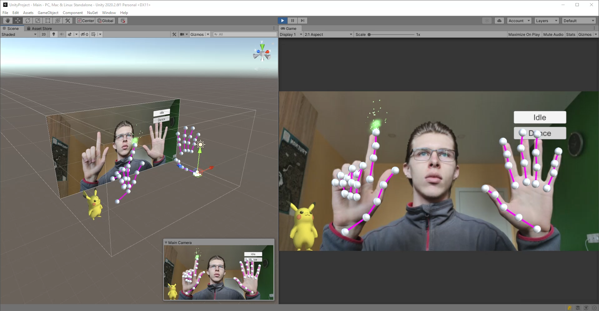

# Unity Minimal Hand

A hand motion capture from a single color camera + Unity + a virtual webcam (you can use it in Zoom, Discord, etc.).

## [Demo](https://www.youtube.com/watch?v=q_P_4KuAIVw)

## How to use

1) Do steps (Prepare MANO, ...) from the original [Usage](https://github.com/CalciferZh/minimal-hand#usage) section of the minimal-hand repository

2) [Optional] Install the OBS virtual camera as described in the [pyvirtualcam](https://github.com/letmaik/pyvirtualcam) repository

3) Run the *app1.py* script

4) Run the *Main.unity* scene (Unity 2020 is required for C# 8 support)

## Tips

* Use the debug.ipynb Jupyter notebook to execute step-by-step

## Known issues

* 24 FPS on Nvidia GTX 1080 is rather few
* 2 FPS on TensorFlow >= 2.2.2

## Advantages

* Tensorflow 2
* PEP-8
* Multiplatform